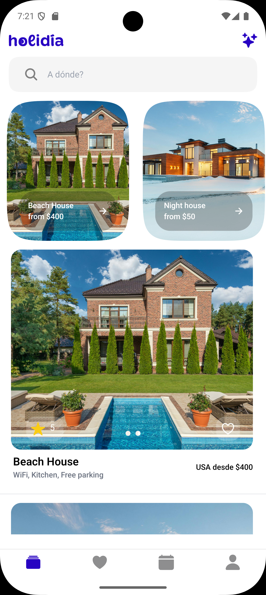
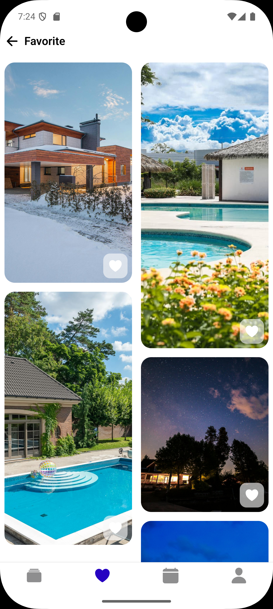
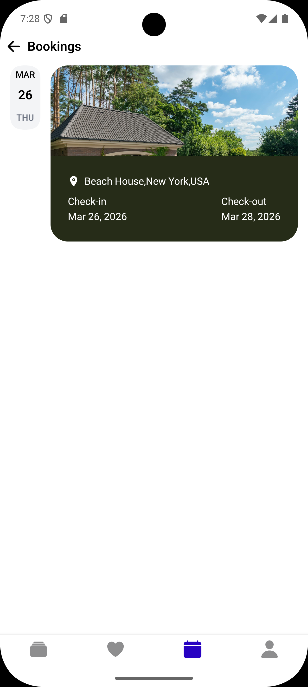
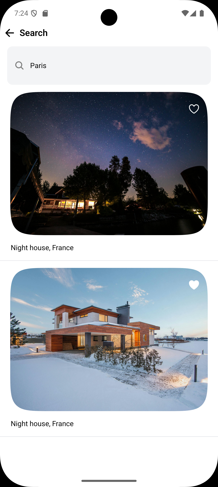
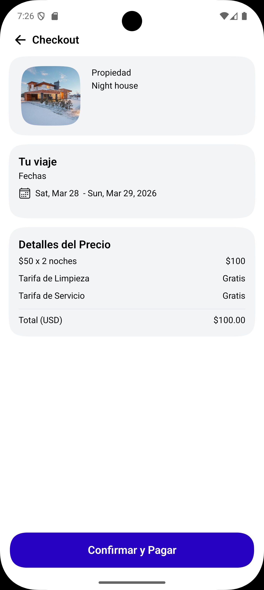
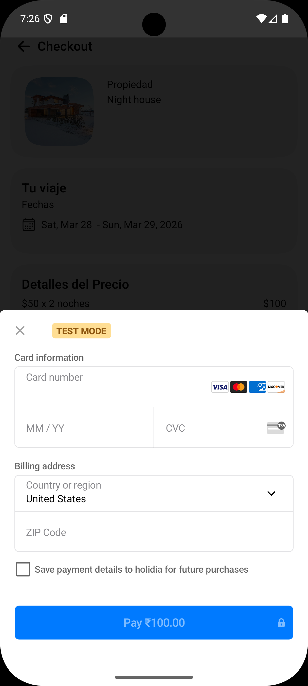

<div align="center">

# 🏖️ Holidia — App de Reservas de Propiedades

**Aplicación móvil para descubrir y reservar propiedades vacacionales**


</div>

---

## Descripción General

Holidia es una aplicación móvil de alto rendimiento para el descubrimiento y reserva de propiedades vacacionales. Ofrece una experiencia de usuario fluida con animaciones avanzadas, un sistema de pago integrado con Stripe y un diseño responsivo que se adapta a distintos tamaños de pantalla. El flujo cubre desde el login hasta la confirmación de reserva, incluyendo búsqueda, detalle de propiedad, selección de fechas y pago.

---


### Autenticación

| Bienvenida | Iniciar Sesión | Registro |
|:----------:|:--------------:|:--------:|
|  |  |  |
| *Pantalla de entrada* | *Login con JWT persistido* | *Crear nueva cuenta* |

---

### Pantallas Principales

| Inicio | Favoritos | Mis Reservas |
|:------:|:---------:|:------------:|
|  |  |  |
| *Exploración de propiedades* | *Propiedades guardadas* | *Historial de reservas* |

---

### Búsqueda y Detalle de Propiedad

| Buscar | Detalle |
|:------:|:-------:|
|  |  |
| *Búsqueda por ciudad con debounce* | *Galería, amenidades y calendario de fechas* |

---

### Reserva y Pago

| Checkout | Pasarela de Pago |
|:--------:|:------------:|
|  |  |
| *Resumen de reserva con Stripe PaymentSheet* | *Formularios de datos bancarios* |

---

## Funcionalidades Principales

**Descubrimiento de propiedades:** Listado de propiedades destacadas en el Home y búsqueda por ciudad con llamadas a la API con debounce para evitar solicitudes innecesarias.

**Detalle y disponibilidad:** Vista completa de la propiedad con imágenes, amenidades y calendario interactivo para seleccionar fechas de entrada y salida, con cálculo dinámico del precio total.

**Favoritos:** Guardado y consulta de propiedades favoritas, visualizadas en una grilla responsiva.

**Reservas:** Historial de reservas pasadas y próximas del usuario autenticado.

**Pago con Stripe:** Flujo de checkout integrado con `@stripe/stripe-react-native`, usando la PaymentSheet nativa. Deep linking hacia Expo Router para el retorno post-pago.

---

## Arquitectura

La app sigue una arquitectura modular con tres capas principales: pantallas (`app/`), lógica de negocio (`core/`) y componentes de UI (`components/`).

```
app/
├── (auth)/                    → Welcome, Login, Signup
├── (tabs)/
│   ├── index.tsx              → Home (listado de propiedades)
│   ├── favorite.tsx           → Favoritos
│   ├── bookings.tsx           → Mis reservas
│   └── profile.tsx            → Perfil
├── properties/[id].tsx        → Detalle de propiedad
├── checkout.tsx               → Proceso de pago
└── payment-success.tsx        → Confirmación de reserva

core/
├── api/
│   └── APIProvider.tsx        → Configuración de Axios + React Query
├── store/
│   ├── useAuthStore.ts        → Estado de sesión (Zustand + MMKV)
│   └── useCartStore.ts        → Estado de reserva en curso

components/
├── home/                      → Discovery, PropertyCard, etc.
├── property/                  → Galería, Amenidades, Calendario
└── shared/                    → Primitivos reutilizables (Squircle, etc.)
```


**Deep linking para pagos:** Expo Router gestiona el retorno desde el flujo externo de Stripe mediante deep links configurados en `app.json`.

---

## Stack Tecnológico

| Categoría | Tecnología |
|---|---|
| Framework | React Native + Expo SDK |
| Lenguaje | TypeScript |
| Navegación | Expo Router (file-based) |
| Estado global | Zustand + MMKV |
| Datos / API | React Query + Axios |
| Pagos | Stripe (react-native-stripe) |
| Animaciones | React Native Reanimated + Moti |
| Gráficos UI | React Native Skia |
| Estilos | NativeWind v4 (Tailwind CSS) |


---

<div align="center">
  Desarrollado por <a href="https://github.com/MatiasParejaG">MatiasParejaG</a>
</div>